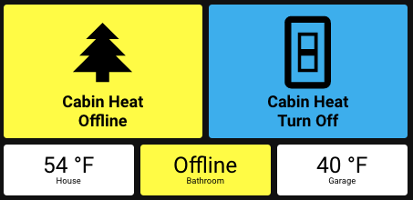

# AutoClimateApp for AppDaemon
This provides an app  and several lower-level services for thermostat management.

The key goals are to enable:

* Monitoring multiple thermostats to see if on, off, or offline
* 1 button click to turn off multiple thermostats
* Automatically "turn off" thermostats if unoccupied for some amount of time. 
* "turn off" can be defined as setting to Away mode, setting a low permanent hold temp, or even turning off completely.
* Make the underlying functionality available as services / sensors / states so you can roll your own apps, either within AppDaemon, or directly from Home Assistant.

(This is an [Appdaemon](https://appdaemon.readthedocs.io/en/latest/) application that works with [Home Assistant](https://www.home-assistant.io/) home automation.)

## Sample Use Case
I have a cabin that has a main thermostat (ecobee), one in an unheated garage gym, and a Nuheat floor heater. I want to be sure that we don't accidentally leave the heat on and either cost us a ton of money (heating an uninsulated garage in the dead of winter) or even burn up our whole tank of propane. 

With this, I press one button to turn it all off when I leave. If I forget, after a configurable amount of time it will turn things off properly. For the house, that is setting the ecobee to "Away". For the garage, it is turning it completely off. For the floor heater, which does not have an "Away" mode, it is setting a "permanent hold" to 41 degrees - the lowest it accepts.

Finally, this also enables cool dashboard monitoring (with [Lovelace](https://www.home-assistant.io/lovelace/)) that shows the temperature, if it is "offline" and a color for red (bad), yellow (warning), or green (good).

### Sample Dashboard


This uses [custom-button-card](https://github.com/custom-cards/button-card), [card-mod](https://github.com/thomasloven/lovelace-card-mod), and my forked version of bignumber - [bignumber-fork](https://github.com/rr326/bignumber-card).
## Features

1. **AutoOff Application**  
Automatically "turn off" any climate after it has been unoccupied for too long. "Off" could be "Away" mode, a preset temperature, or literally off.
2. **Summarized State**  
(Eg: app.autoclimate_state)  
This listens for changes to watched thermostat climate entities and creates a master state. See "Exposed State" below.
3. **Event: Turn heat off**  
`app.autoclimate_turn_off_all` - When fired, will turn "off" all climates.
4. **Sensors: Temperature**  
    * Creates temp sensors like `sensor.autoclimate_cabin_temperature`. This is the same as normal temperature sensors except if the `climate` is offline, this sensor will report a null value.
    * The existing sensors defined by the integrations will always show the last value, even if the sensor has been down for a week! [Github Issue](https://github.com/home-assistant/core/issues/43897)
5. **Sensors: Unoccupied Since**  
Creates sensors like `sensor.autoclimate_cabin_unoccupied_since: <timestamp>`. 
6. **Sensors: Last On**  
Creates sensors like `sensor.autoclimate_cabin_laston: <timestamp>`. This is the last time the climate was turned on. (Without this if you turn your climate on remotely to warm up your house, AutoOff will turn it back off. :) )
7. **AppDaemon Services**  
Creates AppDaemon services: `is_offline`, `is_on`, `is_off`, `entity_state`, `is_hardoff`. This makes it easy to build your own AppDaemon apps. (Note - you can NOT call these from HomeAssistant.) 
8. **Test_mode with Mocks**  
(This is for advanced users and developers.)  
When you set `run_mocks: true` and `test_mode: true`, it will run the automation and print to the log, but not actually take the actions (like turning off the thermostat.) If you set mocks (see `autoclimate.yaml.sample`), it will set each entity to the given state, wait a second, and then run the next mock.


## Requirements

[AdPlus](https://github.com/rr326/adplus)

## Configuration
See [autoclimate.yaml.sample](./autoclimate.yaml.sample)

## AutoOff functionality
* Relies on the configuration to determine if an entity is off or not
* Requires: `auto_off_hours` to be set to attempt auto-off
* Will run on every climate update and will poll at frequency: `poll_frequency`
* If `turn_on_error_off: true` will attempt to turn *on* a thermostat that is incorrectly 
  in a hard-off state. ("hard_off" is when the thermostat is set to 'off' and won't run at all.)

## Exposed State
The app will expose a helpful state object under: `app.{name}_state` where
name is defined in `autoclimate.yaml`. (For instance: `app.autoclimate_state`.)

Here is an example:
```yaml
# app.autoclimate_state, in yaml
friendly_name: autoclimate State
summary_state: 'off'
cabin_offline: false
cabin_state: 'off'
cabin_unoccupied: 43.35
cabin_state_reason: 'Away mode at proper temp: 55'
floor_heater_offline: false
floor_heater_state: 'off'
floor_heater_unoccupied: 43.35
floor_heater_state_reason: Perm hold at 41
garage_offline: false
garage_state: 'off'
garage_unoccupied: 68.02
garage_state_reason: Thermostat is off
```

### Details
|field|type|values|explanation|
|-|-|-|-|
|friendly_name|string|{name} State|
|summary_state|string|on \| off \| offline \| error| Summarized state across all entities. Same as the state of `app.autoclimate_state`.
|entity_offline|boolean|true \| false|
|entity_state|string|on \| off \| offline \| error | Summarized state for this entity
|entity_state_reason|string|*explanation*|Explanation of why. Helpful for debugging.
|entity_unoccupied|float|*duration*|How long the autooff sensor has shown unoccupied.

## Event: Turn heat off
### `app.autoclimate_turn_off_all` 
Will turn off all entities
```python
# In AppDaemon app
self.fire_event('app.autoclimate_turn_off_all', config=config_object)
# config= is optional. If absent, use autoclimate.yaml config
```

```yaml
# In Dashboard - requires a script, below
...
tap_action:
    action: call-service
    service: script.fire_event_autoclimate_turn_off_all

# Script, for dashboard
fire_event_autoclimate_turn_off_all:
  alias: "Fire Event - autoclimate_turn_off_all"
  sequence:
  - event: app.autoclimate_turn_off_all
    event_data:
      test_mode: false
```
The `config_object` above is optional. If not present, then it will rely on the configuration from autoclimate.yaml.  Or you can send the configuration as a python object with the same content as the `entity_rules` portion of `autoclimate.yaml`. EG:
```python
configobj = {
    "climate1": {
        "off_state": {
            # ...
        }
    },
    "climate2": {
        #...
    }
}
```

### `app.autoclimate_turn_off_climate` 
Will turn off named entity.
Very similar to the above, but *requires* a `climate=` to be passed to the event. Once again, `config={...}` is optional. If not sent, send just the config for a climate, such as: `climateobj = {"off_state":...}`

## Sensors: _temperature
See the description above in Features. 
A few sub points:

* Created if: `create_temp_sensors: true`
* The sensor name is: `sensor.{name}_{climate_entity_name}_temperature`
* Return value when offline: `math.nan`
* [Github Issue](https://github.com/home-assistant/core/issues/43897)

## Sensors: _unoccupied_since
See the description above in Features.

## Sensors: _laston
See the description above in Features.

## AppDaemon Services
* autoclimate/is_offline
* autoclimate/is_on
* autoclimate/is_off
* autoclimate/is_hardoff
* autoclimate/entity_state
Will return a boolean (or state) based on AutoClimate configuration.

```python
self.call_service('autoclimate/is_on', climate="climate.cabin")
```

## "autoclimate" / "name: " Config
The states, events, etc. above all reference "autoclimate". It is actually all based off the config paramter "name".  EG: `app.{name}_turn_off_climate`

## Integrations
This has been tested with:
* Ecobee
* Nuheat
